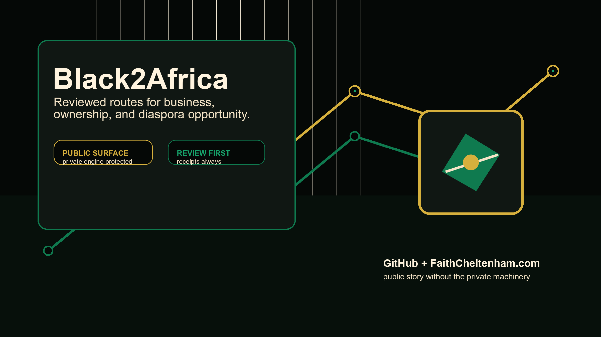
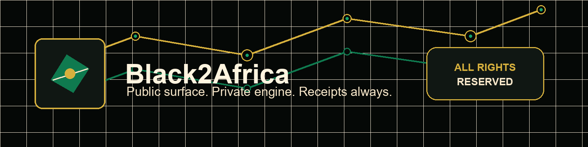
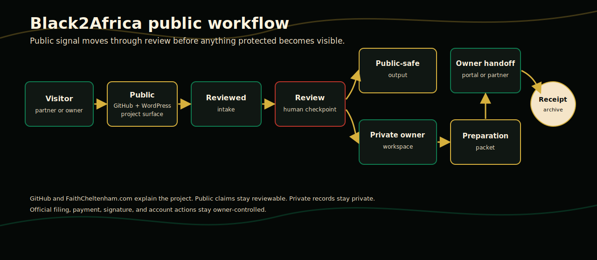
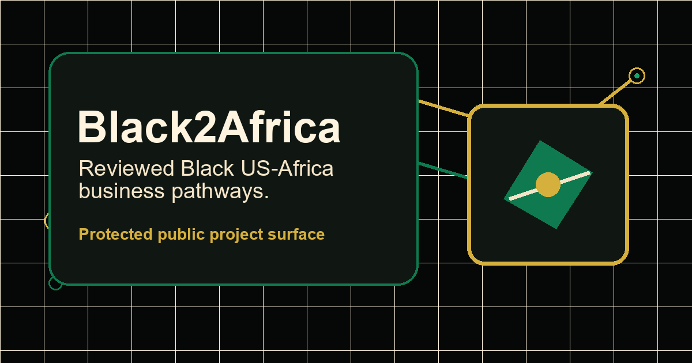
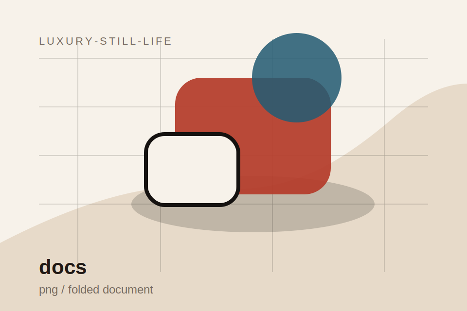
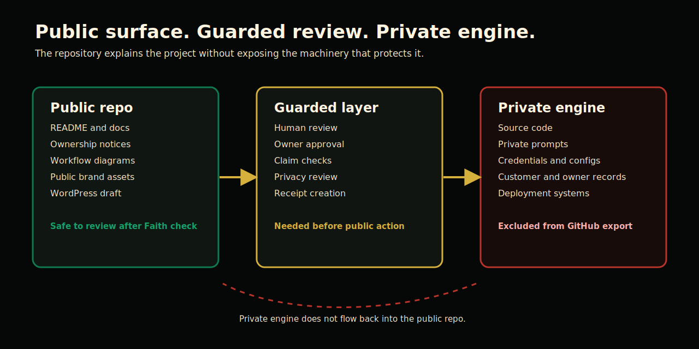

# Black2Africa

Protected public project surface for a reviewed Black US-Africa business network
and owner-protection platform.

This repository is a protected public project surface. It is not the full source
code, operational system, private workflow, or data room.

## What is this?

Black2Africa is a platform concept and working WordPress-backed project for
reviewed Black US-Africa business activity: opportunity discovery, relationship
routing, sponsor pathways, founder support, and private owner-controlled IP
preparation through the Auntie AI lane.

The public surface explains the project, boundary, ownership posture, visual
system, workflow shape, and launch direction without exposing private
implementation details.

## Why does it matter?

Black founders, operators, sponsors, organizers, and diaspora partners need
trusted pathways for cross-border work that do not collapse into generic lead
capture, extractive networking, or public oversharing of private ownership
records.

Black2Africa is designed around reviewed introductions, protected records,
clear handoffs, and receipts.

## Who is it for?

- Black founders and builders working across the United States and Africa
- Diaspora business partners, sponsors, and operators
- Organizations looking for reviewed opportunities and responsible follow-up
- Creators and technical owners preparing copyright, trademark, patent, or
  publishing support materials before an owner-controlled filing step

## How does it work?

The public story is intentionally simple:

1. A visitor starts with a partnership, opportunity, sponsor, or owner-support
   need.
2. Public intake and education help them understand the pathway.
3. Review points keep introductions, claims, and private ownership records from
   becoming public by accident.
4. Public outputs can include project pages, directories, sponsor briefs, or
   learning materials.
5. Protected work moves into private owner-controlled systems, account review,
   external filing portals, or professional handoff only when appropriate.

## Visual Surface

The repository includes public-safe visuals selected from the project brand
system and staged for immediate GitHub and WordPress use.

| Asset | Use |
| --- | --- |
| `assets/hero/hero-image.png` | README and WordPress hero |
| `assets/banners/github-banner.png` | GitHub README banner |
| `assets/social/social-card.png` | Social/Open Graph preview |
| `assets/icons/project-icon.png` | Project icon |
| `assets/gallery/process-illustration.svg` | Public process/gallery visual |
| `assets/gallery/hero-illustration.svg` | Public storytelling visual |

## What is public?

- Project summary and status
- Public/private boundary
- Commercial-use policy
- Roadmap and FAQ
- Workflow diagrams and brand notes
- Image briefs for safe public visuals
- Canva asset plan
- WordPress page draft for FaithCheltenham.com
- Launch checklist and privacy review
- Selected public brand assets

## What remains private?

- Source code and WordPress plugin engine
- Deployment scripts, server paths, production configuration, and zips
- Credentials, secrets, tokens, keys, and OAuth details
- Private prompts, agent instructions, queues, receipts, and logs
- Customer, family, legal, medical, benefits, housing, and private creative data
- Unpublished manuscripts, private datasets, and private filing records

## Current status

The project has a working private source package and a protected public export.
This public repo is intended for review, portfolio, diligence, controlled
project communication, and ecosystem visibility. It is not an open-source
release.

Read the current status in [docs/STATUS.md](docs/STATUS.md).

## Ownership posture

All Rights Reserved.

No public license. No commercial reuse. No redistribution. No training use. No
implied permission.

Commercial use, implementation access, source review, partnership use, or
derivative work requires written permission from Faith Cheltenham or the
authorized rights holder.

## Structural model

The public structure follows the Fantasia-style pattern: docs first, clear
authority boundaries, no hidden production access, receipts, visual workflow
context, and a protected engine behind a public story.

## How to learn more

Start with:

- [Project Brief](docs/PROJECT_BRIEF.md)
- [Workflow Diagrams](docs/WORKFLOW_DIAGRAMS.md)
- [Public / Private Boundary](docs/PUBLIC_PRIVATE_BOUNDARY.md)
- [Status](docs/STATUS.md)
- [Brand Style Notes](docs/BRAND_STYLE_NOTES.md)
- [Image Asset Audit](docs/IMAGE_ASSET_AUDIT.md)
- [Canva Asset Plan](docs/CANVA_ASSET_PLAN.md)
- [WordPress Page Draft](wordpress/page.md)

For licensing, ownership, commercial use, or partnership questions, written
permission is required from Faith Cheltenham or the authorized rights holder.
