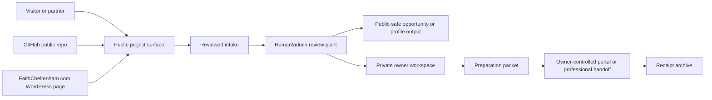
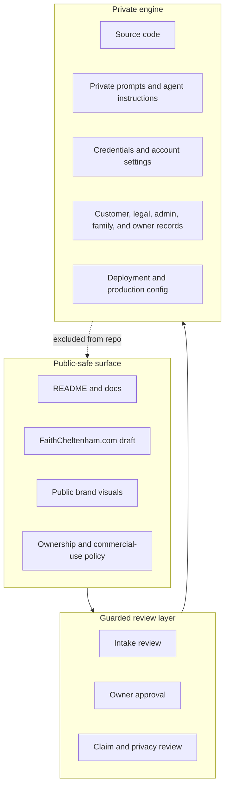

# Workflow Diagrams

These diagrams explain the public Black2Africa workflow without exposing source
code, credentials, private queues, internal prompts, deployment systems, or
protected owner records.

## Workflow Overview

Source: `assets/diagrams/workflow-overview.mmd`

Rendered asset:

## Public / Private Boundary

Source: `assets/diagrams/public-private-boundary.mmd`

Rendered asset:

## Safety Notes

- The diagrams describe workflow categories, not implementation architecture.
- The public workflow explicitly connects the GitHub public repo and
  FaithCheltenham.com WordPress draft to the same public project surface.
- They intentionally omit server paths, API routes, schemas, credentials, and
  production adapters.
- They are suitable for README, GitHub social review, and a public WordPress
  project page.
